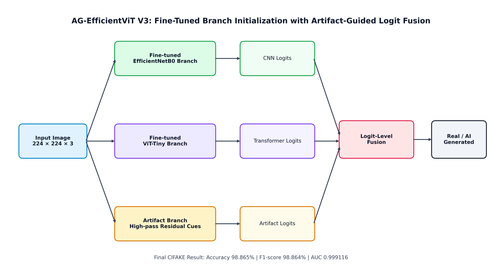
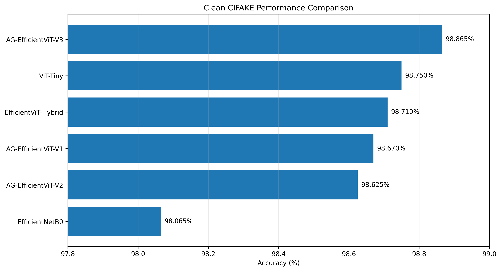
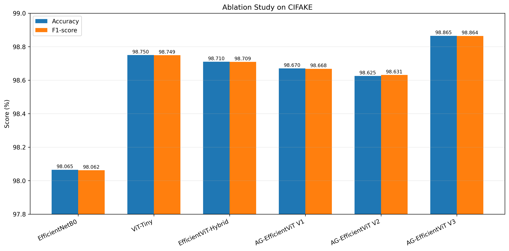
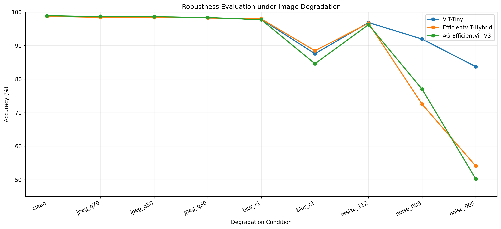
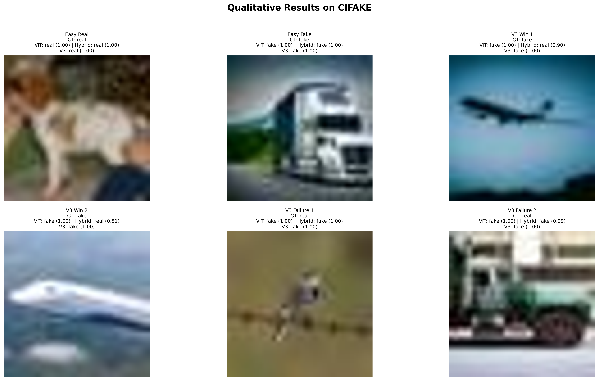
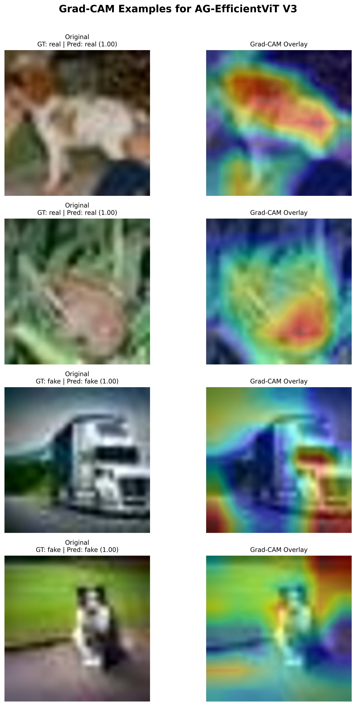

# Artifact Guided EfficientViT: A Robust Hybrid CNN and Transformer Framework for AI Generated Image Detection

<p align="center">
  <b>AG-EfficientViT V3</b><br>
  A journal-style research repository for AI-generated image detection using artifact-guided hybrid CNN-Transformer fusion.
</p>

<p align="center">
  
  
  
  
  
  
  
</p>

---

## Abstract

The rapid advancement of generative artificial intelligence has increased the difficulty of distinguishing authentic images from AI-generated content. Existing convolutional neural networks and Vision Transformer models have shown strong performance in visual classification tasks; however, single-branch architectures may not fully capture both local artifact traces and global semantic inconsistencies in synthetic images. This repository presents **Artifact Guided EfficientViT (AG-EfficientViT)**, a hybrid CNN-Transformer framework for AI-generated image detection. The final proposed model, **AG-EfficientViT V3**, integrates a fine-tuned EfficientNetB0 branch, a fine-tuned ViT-Tiny branch, and an artifact-oriented branch through logit-level fusion. Experiments on the CIFAKE dataset show that AG-EfficientViT V3 achieves **98.865% accuracy**, **98.864% F1-score**, and **0.999116 AUC**, outperforming EfficientNetB0, ViT-Tiny, EfficientViT-Hybrid, and earlier AG-EfficientViT variants. The results demonstrate that fine-tuned branch initialization and artifact-guided logit fusion provide a stronger detection framework than naïve CNN-Transformer concatenation.

---

## Table of Contents

- [1. Introduction](#1-introduction)
  - [1.1 Background](#11-background)
  - [1.2 Research Motivation](#12-research-motivation)
  - [1.3 Main Contributions](#13-main-contributions)
- [2. Proposed Method](#2-proposed-method)
  - [2.1 Problem Formulation and Notation](#21-problem-formulation-and-notation)
  - [2.2 Overall Architecture](#22-overall-architecture)
  - [2.3 Fine-Tuned EfficientNetB0 Branch](#23-fine-tuned-efficientnetb0-branch)
  - [2.4 Fine-Tuned ViT-Tiny Branch](#24-fine-tuned-vit-tiny-branch)
  - [2.5 Artifact Branch](#25-artifact-branch)
  - [2.6 Artifact-Guided Logit-Level Fusion](#26-artifact-guided-logit-level-fusion)
  - [2.7 Training Objective](#27-training-objective)
  - [2.8 Difference Between V1, V2, and V3](#28-difference-between-v1-v2-and-v3)
- [3. Dataset and Experimental Setup](#3-dataset-and-experimental-setup)
  - [3.1 Dataset Description](#31-dataset-description)
  - [3.2 Dataset Organization](#32-dataset-organization)
  - [3.3 Evaluation Metrics](#33-evaluation-metrics)
- [4. Experimental Results and Analysis](#4-experimental-results-and-analysis)
  - [4.1 Clean-Test Performance](#41-clean-test-performance)
  - [4.2 Ablation Study](#42-ablation-study)
  - [4.3 Robustness Analysis](#43-robustness-analysis)
  - [4.4 Qualitative Results](#44-qualitative-results)
  - [4.5 Visual Interpretability](#45-visual-interpretability)
- [5. Repository Usage](#5-repository-usage)
  - [5.1 Repository Structure](#51-repository-structure)
  - [5.2 Installation](#52-installation)
  - [5.3 Training](#53-training)
  - [5.4 Evaluation](#54-evaluation)
- [6. Limitations](#6-limitations)
- [7. Future Work](#7-future-work)
- [8. Citation](#8-citation)
- [9. Author and Contact](#9-author-and-contact)

---

# 1. Introduction

## 1.1 Background

AI-generated images are becoming increasingly realistic due to the rapid development of generative models. This creates a growing need for reliable detection systems that can distinguish real images from synthetic images in digital media, security, education, and forensic applications.

Convolutional neural networks are effective in capturing local spatial and texture patterns, while Vision Transformers are strong in modeling global dependencies and semantic-level inconsistencies. However, AI-generated image detection often requires both types of information: local artifact traces and global representation cues.

## 1.2 Research Motivation

A simple combination of CNN and Transformer features does not always guarantee improved detection performance. In this project, the simple EfficientViT-Hybrid baseline did not outperform the strongest single-branch ViT-Tiny baseline. This motivates a more careful fusion strategy that uses fine-tuned branch initialization and artifact-guided decision fusion.

The main research motivation is therefore to develop a hybrid detection model that can preserve the strengths of CNN and Transformer branches while introducing artifact-aware correction at the decision level.

## 1.3 Main Contributions

The main contributions of this repository are summarized as follows:

1. **Hybrid CNN-Transformer Detection Framework**  
   This repository implements AG-EfficientViT, a hybrid framework for AI-generated image detection.

2. **Fine-Tuned Branch Initialization**  
   The final model initializes its CNN and Transformer branches using separately fine-tuned EfficientNetB0 and ViT-Tiny checkpoints.

3. **Artifact-Guided Logit-Level Fusion**  
   AG-EfficientViT V3 introduces artifact-guided logit-level fusion to combine CNN logits, Transformer logits, and artifact logits.

4. **Transparent Variant-Level Ablation**  
   The repository reports EfficientNetB0, ViT-Tiny, EfficientViT-Hybrid, AG-EfficientViT V1, AG-EfficientViT V2, and AG-EfficientViT V3 to make the evolution of the proposed design explicit.

5. **Robustness and Qualitative Analysis**  
   The repository includes robustness evaluation under JPEG compression, blur, resize degradation, and additive noise, together with qualitative and interpretability-oriented visual outputs.

---

# 2. Proposed Method

## 2.1 Problem Formulation and Notation

Let \(x \in \mathbb{R}^{H \times W \times 3}\) denote an input RGB image and \(y \in \{0,1\}\) denote its binary label, where \(0\) represents an AI-generated image and \(1\) represents a real image, following the class indexing used by the dataset loader.

The goal is to learn a binary classifier:

\[
f_{\theta}(x) \rightarrow \hat{y},
\]

where \(\hat{y}\) is the predicted class label. The model produces a two-dimensional logit vector:

\[
z = [z_0, z_1] \in \mathbb{R}^{2}.
\]

The posterior probability is obtained using the softmax function:

\[
p(y=k \mid x) =
\frac{\exp(z_k)}
{\sum_{j=0}^{1}\exp(z_j)},
\quad k \in \{0,1\}.
\]

The final prediction is:

\[
\hat{y} = \arg\max_{k \in \{0,1\}} p(y=k \mid x).
\]

## 2.2 Overall Architecture

The proposed **AG-EfficientViT V3** framework consists of three parallel branches and a final logit-level fusion stage.

<p align="center">
  
</p>

**Figure 1.** Overall architecture of the proposed AG-EfficientViT V3 framework. The model combines a fine-tuned EfficientNetB0 branch, a fine-tuned ViT-Tiny branch, and an artifact branch through logit-level fusion.

The three branch outputs are defined as:

\[
z_{\mathrm{cnn}} = f_{\mathrm{cnn}}(x;\theta_{\mathrm{cnn}}),
\]

\[
z_{\mathrm{vit}} = f_{\mathrm{vit}}(x;\theta_{\mathrm{vit}}),
\]

\[
z_{\mathrm{art}} = f_{\mathrm{art}}(x;\theta_{\mathrm{art}}),
\]

where \(z_{\mathrm{cnn}}\), \(z_{\mathrm{vit}}\), and \(z_{\mathrm{art}}\) are the class logits produced by the EfficientNetB0 branch, ViT-Tiny branch, and artifact branch, respectively.

## 2.3 Fine-Tuned EfficientNetB0 Branch

The EfficientNetB0 branch is used to capture local image patterns, including texture details, edge-level irregularities, and high-frequency spatial cues. In AG-EfficientViT V3, this branch is initialized from the best fine-tuned EfficientNetB0 checkpoint trained on CIFAKE.

Formally, the CNN branch produces:

\[
z_{\mathrm{cnn}} = f_{\mathrm{cnn}}(x;\theta_{\mathrm{cnn}}^{*}),
\]

where \(\theta_{\mathrm{cnn}}^{*}\) denotes the fine-tuned EfficientNetB0 parameters obtained from the EfficientNetB0 baseline training stage.

## 2.4 Fine-Tuned ViT-Tiny Branch

The ViT-Tiny branch is used to capture global semantic representation and long-range dependencies. This branch provides a complementary view to the CNN branch by modeling image-level consistency and broader structural information.

The Transformer branch produces:

\[
z_{\mathrm{vit}} = f_{\mathrm{vit}}(x;\theta_{\mathrm{vit}}^{*}),
\]

where \(\theta_{\mathrm{vit}}^{*}\) denotes the fine-tuned ViT-Tiny parameters obtained from the ViT-Tiny baseline training stage.

## 2.5 Artifact Branch

The artifact branch is designed to extract artifact-oriented information related to synthetic image traces. In contrast to the CNN and Transformer branches, which are initialized from strong fine-tuned classifiers, the artifact branch provides an additional trainable pathway for artifact-sensitive correction.

Let \(h_{\mathrm{art}}\) denote the artifact feature representation:

\[
h_{\mathrm{art}} = g_{\mathrm{art}}(x;\theta_{\mathrm{art}}),
\]

where \(g_{\mathrm{art}}\) is the artifact feature extractor. The artifact branch logits are obtained by:

\[
z_{\mathrm{art}} = W_{\mathrm{art}}h_{\mathrm{art}} + b_{\mathrm{art}}.
\]

This branch is not intended to replace the CNN or Transformer branch, but to provide complementary artifact-sensitive evidence during the final fusion stage.

## 2.6 Artifact-Guided Logit-Level Fusion

AG-EfficientViT V3 performs fusion at the logit level rather than by naïvely concatenating intermediate features. The final logit vector is computed as a weighted combination of the three branch logits:

\[
z_{\mathrm{final}} =
\alpha_{\mathrm{cnn}} z_{\mathrm{cnn}}
+
\alpha_{\mathrm{vit}} z_{\mathrm{vit}}
+
\alpha_{\mathrm{art}} z_{\mathrm{art}}.
\]

The fusion weights are normalized using softmax:

\[
[\alpha_{\mathrm{cnn}}, \alpha_{\mathrm{vit}}, \alpha_{\mathrm{art}}]
=
\mathrm{softmax}(w),
\]

where \(w \in \mathbb{R}^{3}\) is a learnable fusion-weight vector.

In the implemented AG-EfficientViT V3 model, the initial fusion tendency is ViT-dominant, CNN-supportive, and artifact-conservative:

\[
w = [1.0,\;2.5,\;-2.0],
\]

which produces the initial normalized weights:

\[
\alpha_{\mathrm{cnn}} \approx 0.1808,\quad
\alpha_{\mathrm{vit}} \approx 0.8102,\quad
\alpha_{\mathrm{art}} \approx 0.0090.
\]

This initialization preserves the strong decision boundary of the fine-tuned ViT-Tiny branch while allowing the CNN and artifact branches to contribute to the final prediction.

## 2.7 Training Objective

The model is trained using the standard cross-entropy loss. For a training set \(\mathcal{D}=\{(x_i,y_i)\}_{i=1}^{N}\), the objective is:

\[
\mathcal{L}_{\mathrm{CE}}
=
-\frac{1}{N}
\sum_{i=1}^{N}
\sum_{k=0}^{1}
\mathbb{1}(y_i=k)
\log p(y=k \mid x_i).
\]

The final probability is computed from \(z_{\mathrm{final}}\):

\[
p(y=k \mid x_i)
=
\mathrm{softmax}(z_{\mathrm{final}})_k.
\]

During V3 training, the fine-tuned CNN and ViT branches provide strong initialized decision signals, while the artifact branch and fusion weights are optimized to improve final classification.

## 2.8 Difference Between V1, V2, and V3

The AG-EfficientViT variants are intentionally reported to make the model development process transparent. V1 and V2 are not hidden failed attempts; they are retained as ablation variants to show why the final V3 design was selected.

| Model Variant | Main Design | Initialization Strategy | Fusion Level | Artifact Branch | Result Summary |
|---|---|---|---|---|---|
| **AG-EfficientViT V1** | Initial artifact-guided hybrid model | Generic pretrained branch initialization | Artifact-guided hybrid fusion | Yes | Competitive but below ViT-Tiny and V3 |
| **AG-EfficientViT V2** | Revised gated fusion variant | Generic pretrained branch initialization | Gated concatenation / interaction-level fusion | Yes | Higher recall, but lower precision and accuracy |
| **AG-EfficientViT V3** | Final proposed model | Fine-tuned EfficientNetB0 + fine-tuned ViT-Tiny checkpoints | Logit-level fusion | Yes | Best overall clean CIFAKE performance |

### 2.8.1 AG-EfficientViT V1

AG-EfficientViT V1 introduced the initial artifact-guided hybrid design. It combined CNN, Transformer, and artifact-oriented information, but the branch initialization and fusion strategy were not yet optimal.

Its result was:

\[
\mathrm{Accuracy}_{\mathrm{V1}} = 98.670\%,
\quad
\mathrm{F1}_{\mathrm{V1}} = 98.668\%,
\quad
\mathrm{AUC}_{\mathrm{V1}} = 0.998713.
\]

The result shows that simply adding an artifact-aware branch does not automatically improve performance over a strong ViT baseline.

### 2.8.2 AG-EfficientViT V2

AG-EfficientViT V2 explored a revised gated fusion strategy. This variant improved recall but reduced precision, indicating a stronger tendency to predict the positive class.

Its result was:

\[
\mathrm{Accuracy}_{\mathrm{V2}} = 98.625\%,
\quad
\mathrm{Precision}_{\mathrm{V2}} = 98.225\%,
\quad
\mathrm{Recall}_{\mathrm{V2}} = 99.040\%,
\quad
\mathrm{F1}_{\mathrm{V2}} = 98.631\%,
\quad
\mathrm{AUC}_{\mathrm{V2}} = 0.998733.
\]

This behavior suggests that stronger gating does not necessarily lead to better calibration.

### 2.8.3 AG-EfficientViT V3

AG-EfficientViT V3 is the final proposed model. Its main difference is that the CNN and Transformer branches are not trained from generic pretrained initialization only. Instead, they are initialized using the best fine-tuned EfficientNetB0 and ViT-Tiny checkpoints. The model then performs artifact-guided logit-level fusion.

Its result was:

\[
\mathrm{Accuracy}_{\mathrm{V3}} = 98.865\%,
\quad
\mathrm{Precision}_{\mathrm{V3}} = 98.938\%,
\quad
\mathrm{Recall}_{\mathrm{V3}} = 98.790\%,
\quad
\mathrm{F1}_{\mathrm{V3}} = 98.864\%,
\quad
\mathrm{AUC}_{\mathrm{V3}} = 0.999116.
\]

Thus, V3 demonstrates that the most effective strategy is not merely adding more branches, but using strong fine-tuned branch initialization and a calibrated logit-level fusion mechanism.

---

# 3. Dataset and Experimental Setup

## 3.1 Dataset Description

This project uses the **CIFAKE** dataset for binary classification of real and AI-generated images.

| Split | Real Images | Fake Images | Total |
|---|---:|---:|---:|
| Train | 50,000 | 50,000 | 100,000 |
| Test | 10,000 | 10,000 | 20,000 |
| Total | 60,000 | 60,000 | 120,000 |

The dataset is not included in this repository and should be downloaded separately.

## 3.2 Dataset Organization

The dataset should be organized as follows:

```text
data/
└── CIFAKE/
    ├── train/
    │   ├── fake/
    │   └── real/
    └── test/
        ├── fake/
        └── real/
```

## 3.3 Evaluation Metrics

The evaluation uses standard binary classification metrics.

Accuracy is computed as:

\[
\mathrm{Accuracy}
=
\frac{TP+TN}{TP+TN+FP+FN}.
\]

Precision is computed as:

\[
\mathrm{Precision}
=
\frac{TP}{TP+FP}.
\]

Recall is computed as:

\[
\mathrm{Recall}
=
\frac{TP}{TP+FN}.
\]

The F1-score is computed as:

\[
\mathrm{F1}
=
2 \cdot
\frac{\mathrm{Precision}\cdot\mathrm{Recall}}
{\mathrm{Precision}+\mathrm{Recall}}.
\]

AUC measures the area under the receiver operating characteristic curve and reflects the ranking quality of the predicted probabilities.

---

# 4. Experimental Results and Analysis

## 4.1 Clean-Test Performance

The clean-test benchmark on CIFAKE is shown in Table 1.

| Rank | Model | Best Epoch | Accuracy (%) | Precision (%) | Recall (%) | F1-score (%) | AUC |
|---:|---|---:|---:|---:|---:|---:|---:|
| 1 | **AG-EfficientViT V3** | 10 | **98.865** | **98.938** | 98.790 | **98.864** | **0.999116** |
| 2 | ViT-Tiny | 20 | 98.750 | 98.809 | 98.690 | 98.749 | 0.998620 |
| 3 | EfficientViT-Hybrid | 15 | 98.710 | 98.778 | 98.640 | 98.709 | 0.998759 |
| 4 | AG-EfficientViT V1 | 13 | 98.670 | 98.807 | 98.530 | 98.668 | 0.998713 |
| 5 | AG-EfficientViT V2 | 18 | 98.625 | 98.225 | **99.040** | 98.631 | 0.998733 |
| 6 | EfficientNetB0 | 19 | 98.065 | 98.214 | 97.910 | 98.062 | 0.997674 |

**Table 1.** Clean-test performance comparison on CIFAKE.

<p align="center">
  
</p>

**Figure 2.** Performance comparison of all evaluated models on the CIFAKE clean test set.

The results show that **AG-EfficientViT V3** achieves the best overall clean-test performance. Compared with ViT-Tiny, the strongest single-branch baseline, AG-EfficientViT V3 improves accuracy from **98.750%** to **98.865%**, F1-score from **98.749%** to **98.864%**, and AUC from **0.998620** to **0.999116**.

## 4.2 Ablation Study

The ablation study evaluates the contribution of each design choice, including single-branch baselines, simple hybridization, artifact-guided variants, and the final AG-EfficientViT V3 model.

| Variant | CNN Branch | ViT Branch | Artifact Branch | Fusion Strategy | Accuracy (%) | F1-score (%) | AUC |
|---|:---:|:---:|:---:|---|---:|---:|---:|
| EfficientNetB0 | ✓ | - | - | - | 98.065 | 98.062 | 0.997674 |
| ViT-Tiny | - | ✓ | - | - | 98.750 | 98.749 | 0.998620 |
| EfficientViT-Hybrid | ✓ | ✓ | - | Feature Concatenation | 98.710 | 98.709 | 0.998759 |
| AG-EfficientViT V1 | ✓ | ✓ | ✓ | Weighted / artifact-guided fusion | 98.670 | 98.668 | 0.998713 |
| AG-EfficientViT V2 | ✓ | ✓ | ✓ | Gated concatenation / interaction fusion | 98.625 | 98.631 | 0.998733 |
| **AG-EfficientViT V3** | ✓ | ✓ | ✓ | **Logit-level fusion with fine-tuned branch initialization** | **98.865** | **98.864** | **0.999116** |

**Table 2.** Ablation study of AG-EfficientViT variants and baseline models.

<p align="center">
  
</p>

**Figure 3.** Ablation visualization across baselines and AG-EfficientViT variants.

The ablation results show that **naïve hybridization is not sufficient**. Although EfficientViT-Hybrid combines CNN and Transformer features, it does not surpass ViT-Tiny. The strongest result is achieved by AG-EfficientViT V3, indicating that fine-tuned branch initialization and logit-level fusion are more effective than simple concatenation or earlier artifact-guided fusion variants.

## 4.3 Robustness Analysis

Robustness evaluation was performed under multiple degradation conditions, including JPEG compression, Gaussian blur, resize degradation, and additive noise.

<p align="center">
  
</p>

**Figure 4.** Robustness comparison of key models under image degradation.

The robustness analysis shows that AG-EfficientViT V3 performs strongly under clean and JPEG-compressed conditions. However, severe blur, resize degradation, and additive noise remain challenging. Therefore, the robustness claim should be interpreted as degradation-specific rather than universal robustness across all corruptions.

## 4.4 Qualitative Results

Qualitative results are used to inspect representative predictions, including correct classifications, hard cases, and failure cases.

<p align="center">
  
</p>

**Figure 5.** Representative qualitative examples on CIFAKE. This figure should include correctly classified real images, correctly classified AI-generated images, V3 success cases, and V3 failure cases.

| Case ID | Image Type | Ground Truth | ViT-Tiny | EfficientViT-Hybrid | AG-EfficientViT V3 | Notes |
|---|---|---|---|---|---|---|
| Q1 | Real | Real | Correct | Correct | Correct | Easy real sample |
| Q2 | Fake | Fake | Correct | Correct | Correct | Easy generated sample |
| Q3 | Fake | Fake | Incorrect | Incorrect | Correct | V3 improves prediction |
| Q4 | Real | Real | Correct | Incorrect | Correct | Artifact-guided correction helps |
| Q5 | Real/Fake | Real/Fake | Correct | Correct | Incorrect | Failure case |
| Q6 | Real/Fake | Real/Fake | Incorrect | Correct | Incorrect | Ambiguous case |

**Table 3.** Template for qualitative case analysis.

The qualitative analysis should emphasize where the final model improves over baselines and where it still fails. This is important for journal-style reporting because it shows not only numerical performance, but also model behavior under visually meaningful cases.

## 4.5 Visual Interpretability

Visual interpretability can be used to analyze which image regions influence the prediction of AG-EfficientViT V3.

<p align="center">
  
</p>

**Figure 6.** Grad-CAM examples for AG-EfficientViT V3.

The interpretability analysis should examine whether the model focuses on artifact-relevant regions such as unnatural textures, edge inconsistencies, object boundaries, or background irregularities. Failure cases should also be inspected to identify misleading activation patterns.

---

# 5. Repository Usage

## 5.1 Repository Structure

```text
AG-EfficientViT/
│
├── configs/
│   └── cifake.yaml
│
├── datasets/
│   ├── __init__.py
│   └── cifake_dataset.py
│
├── docs/
│   └── figures/
│       ├── ag_efficientvit_v3_architecture.png
│       ├── main_results_comparison.png
│       ├── ablation_results.png
│       ├── robustness_plot.png
│       ├── qualitative_results.png
│       └── gradcam_examples.png
│
├── models/
│   ├── __init__.py
│   ├── efficientnet_baseline.py
│   ├── vit_baseline.py
│   ├── efficientvit_baseline.py
│   ├── artifact_branch.py
│   ├── fusion.py
│   ├── fusion_v2.py
│   ├── ag_efficientvit.py
│   ├── ag_efficientvit_v2.py
│   └── ag_efficientvit_v3.py
│
├── results/
│   ├── tables/
│   ├── figures/
│   └── logs/
│
├── scripts/
│   ├── generate_repo_figures.py
│   ├── generate_qualitative_results.py
│   └── generate_gradcam_examples.py
│
├── train.py
├── train_vit.py
├── train_efficientvit.py
├── train_ag_efficientvit.py
├── train_ag_efficientvit_v2.py
├── train_ag_efficientvit_v3.py
│
├── evaluate.py
├── evaluate_vit.py
├── evaluate_efficientvit.py
├── evaluate_ag_efficientvit.py
├── evaluate_ag_efficientvit_v2.py
├── evaluate_ag_efficientvit_v3.py
│
├── robustness_test.py
├── summarize_results.py
├── FINAL_PROJECT_SUMMARY.md
├── requirements.txt
└── README.md
```

## 5.2 Installation

Create and activate a Python environment:

```bash
conda create -n ag_efficientvit python=3.11 -y
conda activate ag_efficientvit
```

Install dependencies:

```bash
pip install -r requirements.txt
```

## 5.3 Training

Train EfficientNetB0 baseline:

```bash
python train.py --epochs 20 --batch-size 128
```

Train ViT-Tiny baseline:

```bash
python train_vit.py --epochs 20 --batch-size 128
```

Train EfficientViT-Hybrid baseline:

```bash
python train_efficientvit.py --epochs 20 --batch-size 64
```

Train AG-EfficientViT V3:

```bash
python train_ag_efficientvit_v3.py --epochs 10 --batch-size 128 --lr 0.0001 --weight-decay 0.0001
```

## 5.4 Evaluation

Evaluate AG-EfficientViT V3:

```bash
python evaluate_ag_efficientvit_v3.py --checkpoint checkpoints/ag_efficientvit_v3_cifake_best.pth --batch-size 128
```

Summarize all model results:

```bash
python summarize_results.py
```

Run robustness evaluation:

```bash
python robustness_test.py --models key --batch-size 128
```

Generate repository figures:

```bash
python scripts/generate_repo_figures.py
python scripts/generate_qualitative_results.py
python scripts/generate_gradcam_examples.py
```

---

# 6. Limitations

This repository currently focuses on the CIFAKE dataset. Although AG-EfficientViT V3 achieves strong clean and JPEG-compressed performance, several limitations remain:

1. External dataset validation is still required to support stronger generalization claims.
2. Severe blur, resize degradation, and additive noise remain challenging.
3. Robustness claims should be interpreted carefully and degradation-specifically.
4. More qualitative and interpretability analysis is needed for stronger scientific evidence.
5. Deployment efficiency and inference latency should be evaluated in future experiments.

---

# 7. Future Work

Future work may include:

1. Cross-dataset validation on external AI-generated image datasets.
2. More stable robustness-aware training strategies.
3. Grad-CAM and attention-based interpretability comparison across baselines.
4. Calibration analysis and threshold optimization.
5. Lightweight deployment and inference benchmarking.
6. Extension to multi-generator and open-set AI-generated image detection.

---

# 8. Citation

If you find this repository useful, please cite it as:

```bibtex
@misc{ag_efficientvit_2026,
  title  = {Artifact Guided EfficientViT: A Robust Hybrid CNN and Transformer Framework for AI Generated Image Detection},
  author = {Mochamad Rizal Fauzan},
  year   = {2026},
  note   = {Research implementation for AI-generated image detection}
}
```

---

# 9. Author and Contact

**Mochamad Rizal Fauzan**  
AI Engineer | Computer Vision Researcher | Embedded Systems and LLM Researcher

For academic discussion, collaboration, or repository-related questions, please open an issue or contact the repository author through GitHub.
